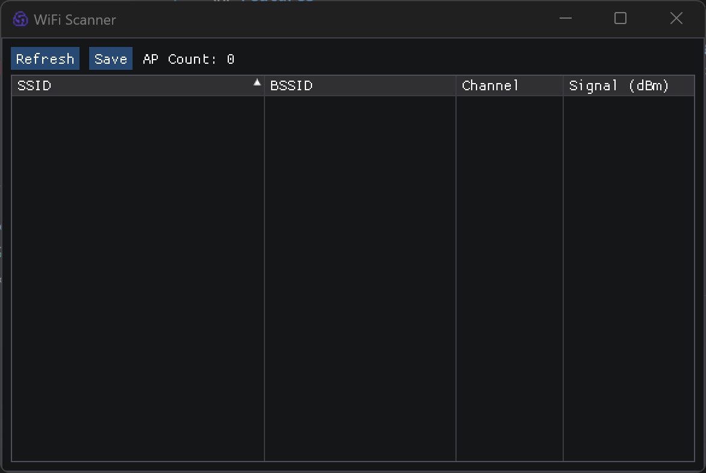

# WiFi Scanner

**WiFi Scanner** is a WiFi scanning tool designed for the Windows platform. It utilizes the Windows WLAN API to perform wireless network scans and presents the results through a user-friendly graphical interface powered by ImGui. The tool supports data sorting, refreshing, and exporting scan results to CSV files. Additionally, the **WifiScanner.hpp** file encapsulates the core logic of WiFi scanning, making it easy to integrate into other projects.

---

## Features

- **WiFi Scanning:**
  - Uses the Windows WLAN API to capture nearby WiFi network information, including SSID, BSSID, channel, and signal strength.
- **Data Display & Sorting:**
  - Displays scan results in a tabular format using ImGui, with support for sorting by SSID, BSSID, channel, and signal strength.
- **CSV Data Export:**
  - Automatically generates file names based on timestamps and saves scan results in the `WIFI/` folder, with operation feedback.
- **Modular Design:**
  - **WifiScanner.hpp** encapsulates all WiFi scanning logic, allowing it to be used as a standalone component for easy integration and extension.

---

## Preview



---

## Build Guide

1. **Clone the Repository**
   
   ```bash
   git clone https://github.com/yourusername/your-repo.git
   cd your-repo
   ```

2. **Create Build Directory & Compile**
   
   ```bash
   mkdir build
   cd build
   cmake ..
   make
   ```

3. **Run the Program:** Execute the generated binary to launch the WiFi scanner.

---

## Core Code Analysis

### WiFi Scanning (WifiScanner.hpp)

The **WifiScanner.hpp** file encapsulates the core WiFi scanning logic, including:

- **WLAN Client Initialization:**
  - Opens a WLAN handle and registers a scan completion callback.
- **Force Refresh Scan:**
  - Iterates over wireless interfaces, initiates a scan request, waits for completion, and updates the AP list.
- **Data Parsing:**
  - Parses scan results returned by the WLAN API, extracting and formatting channel, signal strength, SSID, and BSSID information.
- **Modular Design:**
  - **WifiScanner.hpp** can be used as a standalone component—simply include the header file and link against the `Wlanapi` library to enable wireless network scanning.

### Standalone Usage Example

The following example demonstrates how to use **WifiScanner.hpp** independently to perform WiFi scanning and output the results:

```cpp
#include "WifiScanner.hpp"
#include <iostream>

int main() {
    // Create WifiScanner instance
    WifiScanner scanner;

    // Check if WLAN handle initialization was successful
    if (!scanner.IsValid()) {
        std::cerr << "Failed to initialize WLAN handle!" << std::endl;
        return -1;
    }

    // Trigger scan and wait for completion
    std::cout << "Scanning WiFi access points..." << std::endl;
    scanner.ForceRefresh();

    // Retrieve scan results
    const auto& apList = scanner.GetAPList();
    std::cout << "Found " << apList.size() << " access points:" << std::endl;

    // Output access point information
    for (const auto& ap : apList) {
        std::cout << "SSID: " << ap.ssid 
                  << ", BSSID: " << ap.bssid 
                  << ", Channel: " << (ap.channel > 0 ? std::to_string(ap.channel) : "Unknown")
                  << ", Signal Strength: " << ap.signal << " dBm" 
                  << std::endl;
    }

    return 0;
}
```

Simply include **WifiScanner.hpp** in your project and link against the `Wlanapi` library to reuse this functionality in other projects.

---

## License

This project is licensed under the MIT License. 

---

## Contribution Guide

Feel free to submit Issues or Pull Requests to improve the project. If you have any suggestions or questions, don't hesitate to contact us.

*Developed using ImGui and C++ | Created by Touken*